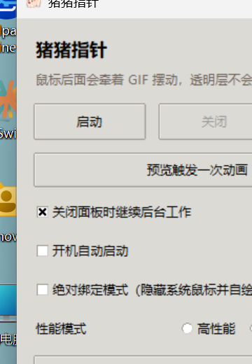
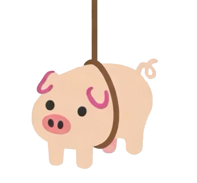

# 猪猪指针

[](https://github.com/LiXXRZ/Pig-Pointer/actions/workflows/build-windows.yml)
[](https://github.com/LiXXRZ/Pig-Pointer/releases/latest)
[](LICENSE)


一个 Windows 桌面小挂件：把会动的小猪或你自己上传的图片 / GIF 通过绳子挂在鼠标后面。它使用逐像素透明窗口绘制，默认不挡住正常点击；也可以开启“绝对绑定模式”，隐藏系统鼠标并由软件自己绘制当前鼠标。

## 界面预览

| 软件界面 | 默认猪猪 GIF |
| --- | --- |
|  |  |

## 下载与运行

最简单的方式是从 GitHub Release 下载已打包版本：

- [下载 PigPointer.exe](https://github.com/LiXXRZ/Pig-Pointer/releases/latest/download/PigPointer.exe)
- [查看所有发布版本](https://github.com/LiXXRZ/Pig-Pointer/releases)

从源码运行：

```powershell
pip install -r requirements.txt
python pig_pointer.py
```

也可以双击：

```text
start_pig_pointer.bat
```

## 使用注意

- 目前仅面向 Windows 桌面环境。
- Release 中的 EXE 没有代码签名，首次运行时 Windows SmartScreen 可能会提示风险。
- 默认透明层不会挡住鼠标点击；开启“绝对绑定模式”后，软件会隐藏真实鼠标并自行绘制鼠标。
- 上传大量图片 / GIF、启用较大尺寸或开启多资源碰撞时，性能占用会升高。

## 功能亮点

- 启动 / 关闭 / 后台运行到系统托盘
- 可选开机自动启动
- 透明置顶显示，默认不影响鼠标点击
- 可滚动设置面板和预览小窗口
- 三档性能模式：高性能 / 普通 / 智能性能
- 智能性能档会根据运动、动画和绘制耗时自动调整刷新节奏
- 调整 GIF 大小、绳子长度、绳子粗细、重量感、动画触发概率、动画播放速度、触发间隔
- 调整鼠标绑定点横向 / 纵向偏移
- 自动记住上次调整的参数
- 一键恢复默认设置，保留上传资源和保存目录
- 绝对绑定模式：隐藏真实鼠标，软件自己绘制当前系统鼠标
- 自定义模式：上传多张图片或 GIF，同时挂在鼠标后面
- 自定义素材可选择保存位置，并可迁移已有素材目录
- 上传素材时会预处理尺寸、帧数、文件大小和裁剪后像素量，用于更细的性能提醒
- 自定义资源支持独立设置大小、绳长、绳子粗细、绳子颜色、动画速度、触发概率、碰撞体积、重量感、动画连续播放和动画往返循环
- 自定义资源支持重命名、上移 / 下移排序、批量启用、批量暂停和清空列表
- 自定义资源列表支持 Ctrl / Shift 多选后批量修改参数
- 自定义资源支持预览拖动和滑块微调连接点，解决上传素材挂点不准的问题
- 自定义资源支持“重物感 / 气球感 / 拖尾串串 / 轻快摆动”预设
- 绳子颜色支持当前色块预览
- 自定义模式可勾选“猪猪也参与”，把默认猪猪加入自定义资源队列
- 多个自定义资源支持低弹性碰撞，碰撞可关闭，并可选择“都连到鼠标”或“串成一串”

## 自定义模式

勾选标题右侧的“自定义模式”后，默认猪猪不会显示。你可以点击“添加图片/GIF”上传自己的素材，或勾选“猪猪也参与”把默认猪猪加入队列。

软件会把上传素材复制到“保存位置”中。之后即使原图被移动，软件也可以继续使用复制后的文件。

自定义模式下，默认模式底部那组猪猪参数会收起；其中仍有用的“触发间隔”和“绑定点横向 / 纵向”会出现在自定义模式的全局设置里。大小、绳长、绳子粗细、重量、动画概率和动画速度则作为每个资源的独立参数调整。

连接方式有两种：

- 都连到鼠标：每个资源都直接挂到同一个鼠标锚点。
- 串成一串：第一个资源挂到鼠标，后面的资源依次挂到前一个资源上。

上传图片 / GIF 的数量不做硬限制，但启用太多资源会影响流畅度。软件会根据资源数量、显示面积、动画帧数、文件大小、素材帧像素量、碰撞计算量和触发概率给出提醒。资源较多时，碰撞会先用空间分桶减少无效检查；密集堆叠时会降低碰撞频率并优先处理近邻资源。

## 连接点校准

上传素材如果自动挂点不准确，可以使用预览窗口下方的“连接点校准”。

- `自动识别`：软件尝试使用每帧顶部可见区域作为连接点。
- `手动固定`：所有帧使用同一个连接点，适合大多数自定义素材。
- 可以在预览图上点击 / 拖动连接点。
- 也可以用横向 / 纵向滑块做细调。

列表支持 Ctrl / Shift 多选，修改参数时会批量应用到选中的上传资源。

## 自行打包

安装打包依赖：

```powershell
pip install -r requirements-dev.txt
```

运行：

```powershell
.\build.ps1
```

打包完成后会生成：

```text
dist\PigPointer.exe
```

## 常见问题

### 会挡住鼠标点击吗？

默认不会。透明层设置为穿透点击，只负责显示动画。

### 动画素材为什么实际运行时不动？

自定义多帧素材支持两种播放方式：概率触发和连续播放。需要一直动的动画素材可以勾选“动画连续播放”。静态图片不会受到动画速度、触发概率或触发间隔影响。

### 上传素材的绳子接错位置怎么办？

在自定义模式里选择对应资源，使用预览窗口下方的“连接点校准”。推荐先切到“手动固定”，再拖动预览里的连接点。

### 绝对绑定模式是什么？

普通模式下系统鼠标还是真实鼠标，透明层只跟随绘制；绝对绑定模式会隐藏系统鼠标，并在透明层里重画鼠标，让绳子视觉上更像固定在鼠标上。

### 设置保存在哪里？

设置会保存到当前用户的应用数据目录，例如：

```text
%APPDATA%\PigPointer\settings.json
```

## 项目结构

```text
.
├─ pig_pointer.py          主程序
├─ pig_pointer.gif         默认小猪动画
├─ pig_pointer.ico         软件图标
├─ start_pig_pointer.bat   源码运行启动脚本
├─ build.ps1               PyInstaller 打包脚本
├─ requirements.txt        运行依赖
└─ requirements-dev.txt    打包依赖
```

`dist/PigPointer.exe` 是本地打包产物，不纳入源码仓库；正式下载请使用 GitHub Release。

## 技术路线

当前技术路线是 Python + Tkinter 设置面板 + Windows layered window 透明层 + Pillow 渲染。透明层负责绘制绳子、猪猪或自定义素材；参数会保存到当前用户的应用数据目录，重新打开软件后自动恢复。

## 许可证

本项目使用 MIT License。详见 [LICENSE](LICENSE)。
